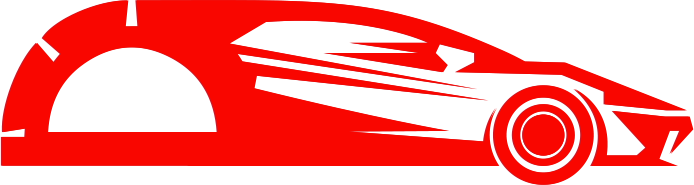

# promod

<p align="center">
  
</p>

Browser automation library with a unified API over [Playwright](https://playwright.dev/) and [Selenium WebDriver](https://www.selenium.dev/documentation/webdriver/).

Promod provides a **protractor-like** lazy element interface — elements are not resolved until an action is performed on them.

## Installation

```bash
npm install promod
```

Promod requires a browser engine as a peer dependency:

```bash
# For Playwright
npm install playwright

# For Selenium WebDriver
npm install selenium-webdriver chromedriver
```

## Quick start

### Playwright

```js
const { chromium } = require('playwright');
const { playwrightWD } = require('promod');
const { browser, $, $$ } = playwrightWD;

async function main() {
  const launched = await chromium.launch({ headless: false });
  browser.setClient({ driver: launched });

  await browser.get('https://example.com');

  const heading = $('h1');
  console.log(await heading.getText());

  await browser.quitAll();
}

main();
```

### Selenium WebDriver

```js
const { Browser, Builder } = require('selenium-webdriver');
require('chromedriver');
const { seleniumWD } = require('promod');
const { browser, $, $$ } = seleniumWD;

async function main() {
  const driver = await new Builder().forBrowser(Browser.CHROME).build();
  browser.setClient({
    driver,
    lauchNewInstance: () => new Builder().forBrowser(Browser.CHROME).build(),
  });

  await browser.get('https://example.com');

  const heading = $('h1');
  console.log(await heading.getText());

  await browser.quit();
}

main();
```

## ESM / CommonJS

Promod ships dual builds. Bundlers and Node `import` will use ESM; `require()` will use CommonJS.

```js
// ESM
import { playwrightWD, seleniumWD } from 'promod';

// CommonJS
const { playwrightWD, seleniumWD } = require('promod');
```

## Selector strategies

All examples work identically with both `playwrightWD` and `seleniumWD`.

```js
// CSS (default)
const el = $('.my-class #id a[href*="link"]');

// XPath
const el = $('xpath=.//div[@data-test="id"]/span');

// JavaScript function
const el = $(() => document.querySelector('div > span'));

// Custom selector (query + text filter)
const el = $({ query: 'button', text: 'Submit' });
const el = $({ query: 'button', rg: 'Sub.*' }); // regex filter
```

## API

| Topic | Link |
| --- | --- |
| Engine setup | [docs/init.md](./docs/init.md) |
| Browser (client) | [docs/client.md](./docs/client.md) |
| Element (`$`) | [docs/element.md](./docs/element.md) |
| Elements (`$$`) | [docs/elements.md](./docs/elements.md) |

## License

MIT
